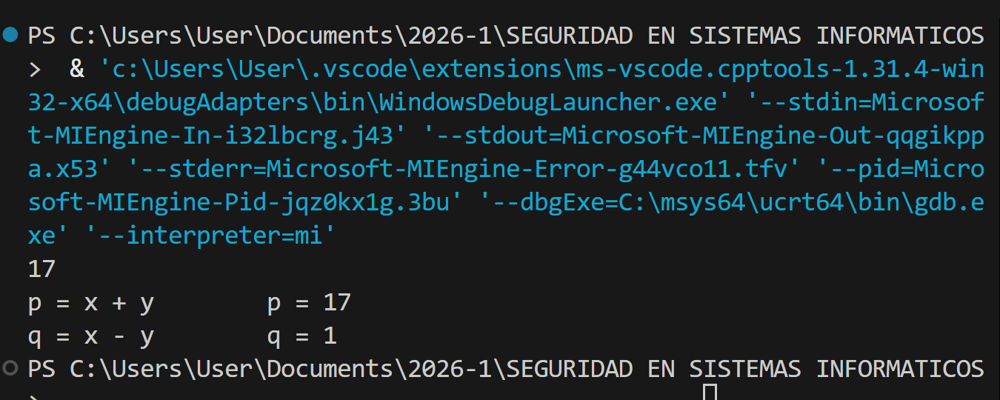
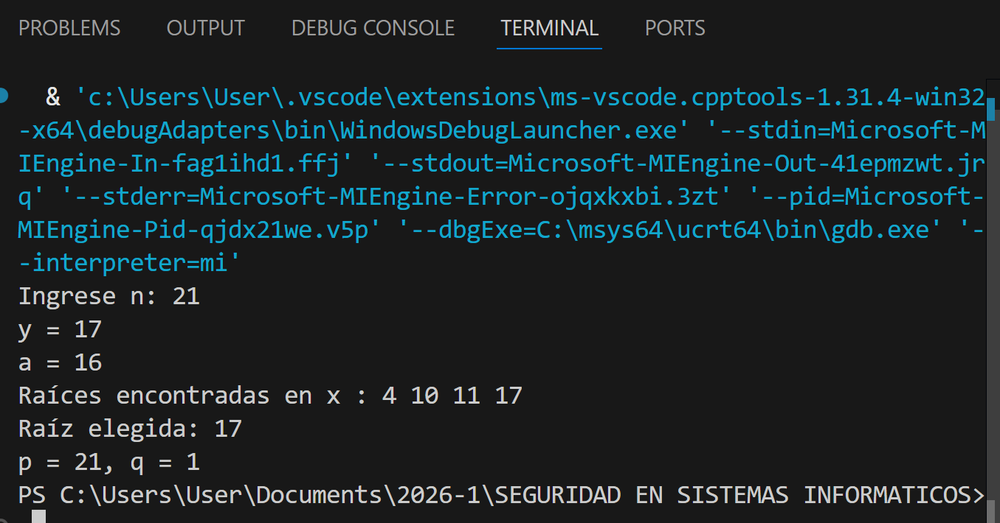

# Informe Técnico: Algoritmos de Factorización en C++ - MIGUEL ANGEL MÉNDEZ GONZALO

Este documento analiza dos enfoques distintos para resolver el problema de la factorización de un número entero $n$ en sus factores primos $p$ y $q$.

## 1. Algoritmo de Fermat (`AlgoritmoFermat.cpp`)

Este código implementa el **Método de Factorización de Fermat**, que se basa en la representación de un número impar como la diferencia de dos cuadrados: $n = x^2 - y^2$.

### Funcionamiento:
* Calcula el primer valor de $x$ como la raíz cuadrada de $n$ redondeada hacia arriba.
* Entra en un bucle donde busca un valor de $x$ tal que $x^2 - n$ sea un **cuadrado perfecto** ($y^2$).
* Una vez encontrado, utiliza la identidad de diferencia de cuadrados:
    $$n = (x + y)(x - y)$$
    Donde $p = x + y$ y $q = x - y$.

### Observaciones:
* Es muy eficiente cuando los factores $p$ y $q$ están **cerca uno del otro**.
* El código usa una función personalizada `esDecimal` para validar si el resultado de la raíz cuadrada es un entero.

---
### Salida del código

## 2. Reducción a Factorización vía Raíces Cuadradas (`ReducFactorizacionRaizCuadrada.cpp`)

Este segundo código utiliza un enfoque probabilístico basado en la **congruencia de cuadrados**. La idea es encontrar dos números $x$ e $y$ tales que $x^2 \equiv y^2 \pmod n$.

### Funcionamiento:
* Elige un valor fijo $y = 17$ y calcula $a = y^2 \pmod n$.
* Recorre todos los números desde $0$ hasta $n-1$ para encontrar todos los valores de $x$ que cumplen $x^2 \equiv a \pmod n$.
* Selecciona una raíz $x$ al azar de la lista generada. Si $x$ no es simplemente $\pm y \pmod n$, entonces el Máximo Común Divisor (**MCD**) entre $(x - y)$ y $n$ nos dará un factor no trivial de $n$.

### Limitaciones:
* El bucle `for (int i = 0; i < n; i++)` hace que este código sea muy lento para números grandes, ya que es una búsqueda lineal.

### Observaciones:
* Utiliza el algoritmo de Euclides para encontrar el factor común, lo cual es una técnica fundamental en criptografía.

### Salida del código:

---

## Conclusión
Mientras que el Algoritmo de Fermat es una técnica clásica y determinista muy útil para ciertos casos de RSA, el segundo código ilustra el concepto teórico de cómo encontrar raíces cuadradas modulares puede romper la seguridad de un número compuesto, aunque su implementación actual sea pedagógica y no apta para números de gran escala.